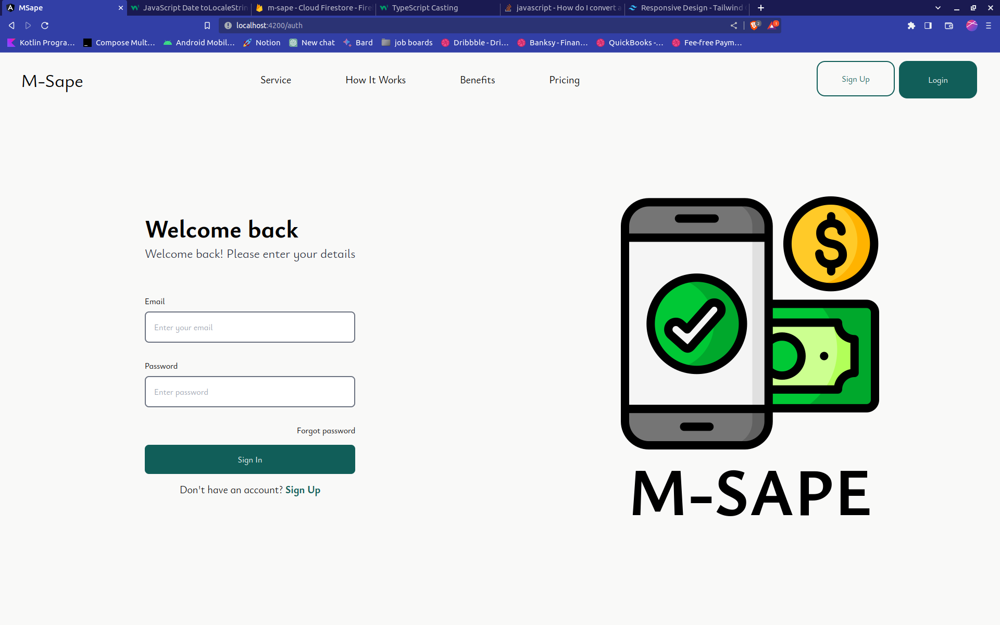
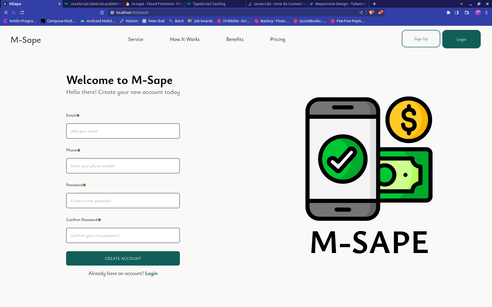
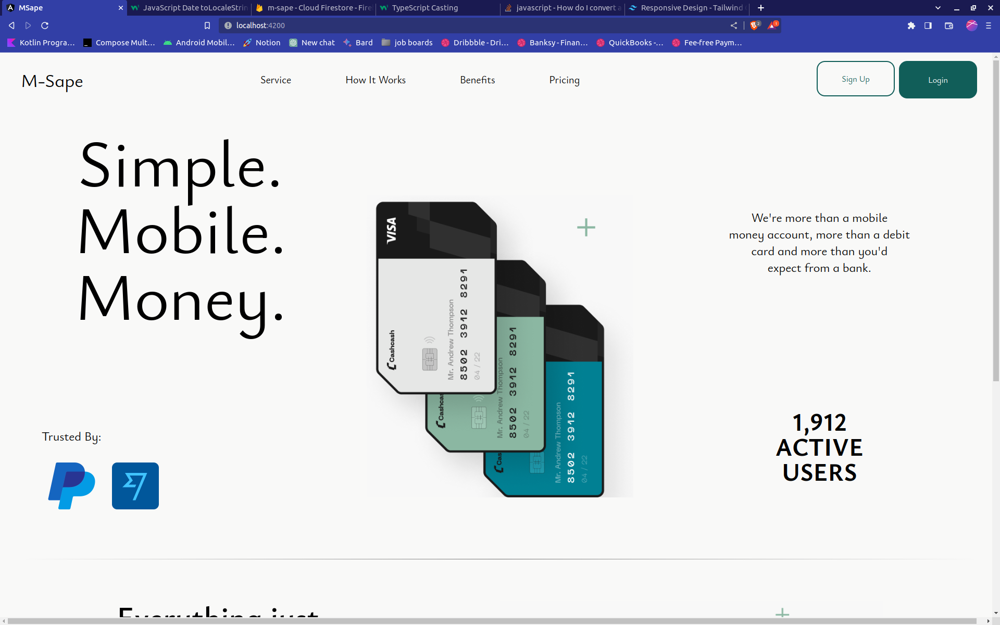
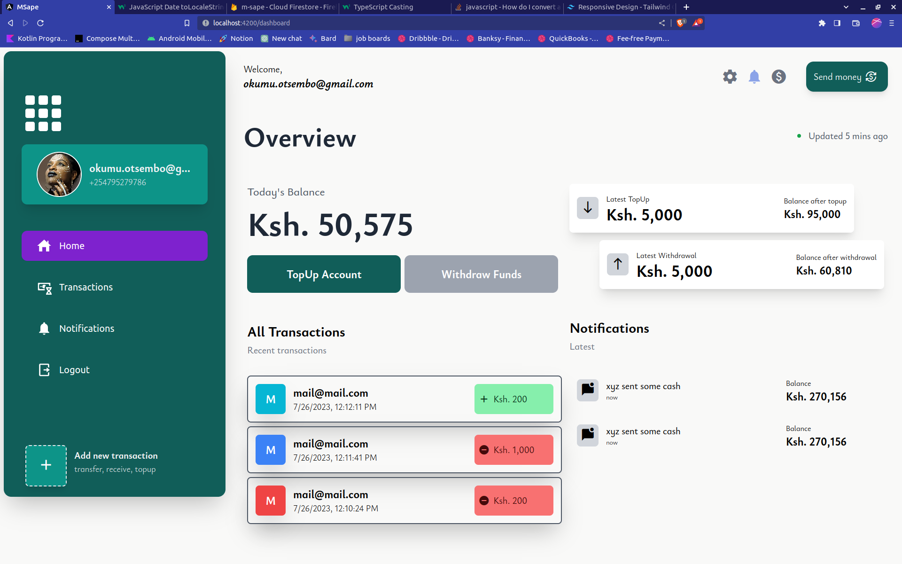

# MSape

M-Sape is a simple M-Pesa clone. This application was part of my interview for frontend engineer with Quikk.

## Tools

This application has been built with the following:

- Angular v16.0
- Tailwind CSS
- Firebase
- Cloud Firestore

## Features

The following features are available:

- Authentication using Firebase Authentication
- Send Money using email
- TopUp / Withdraw

## Screenshots
The following are shots of what I have been working on:

login | register |
----- | -------- |
 |  |

landing | dashboard |
----- | -------- |
 |  |


## Authors
This application was built by the following:

- [otsembo](https://github.com/otsembo)

## License
This application has been licensed under the MIT license

```

```
